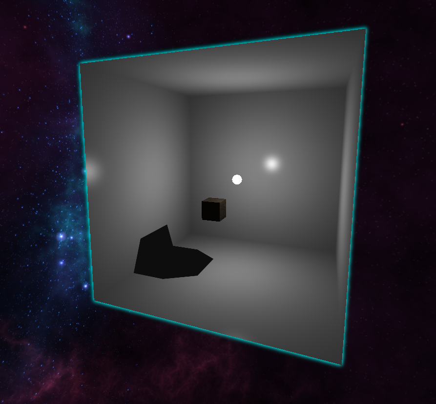
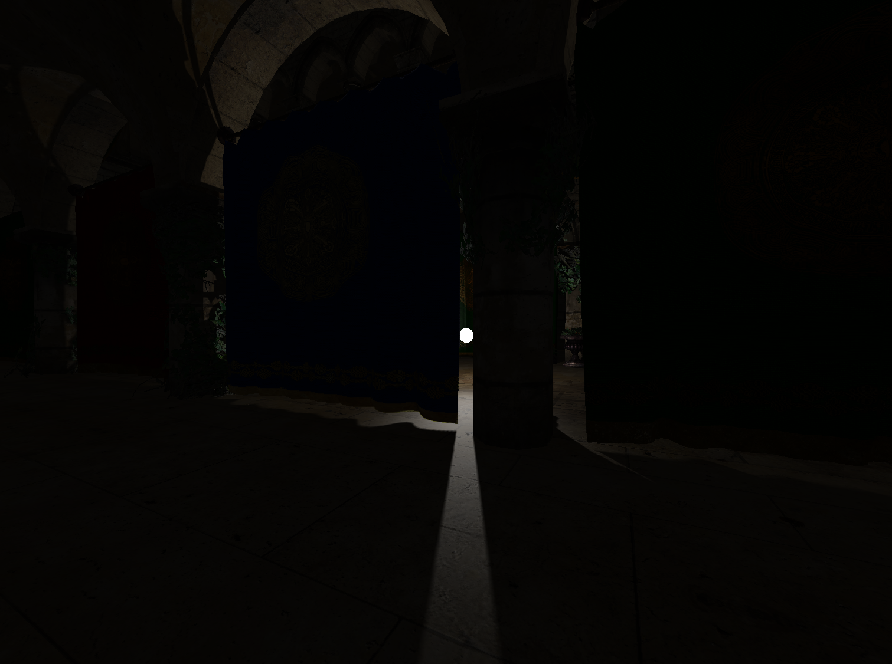
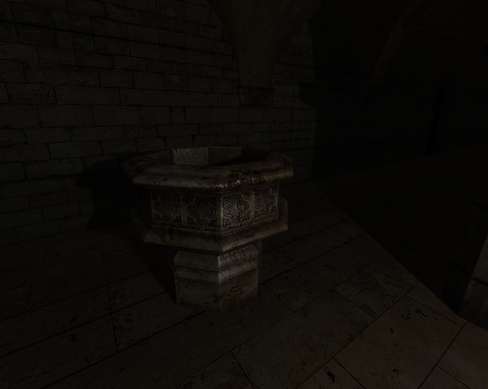
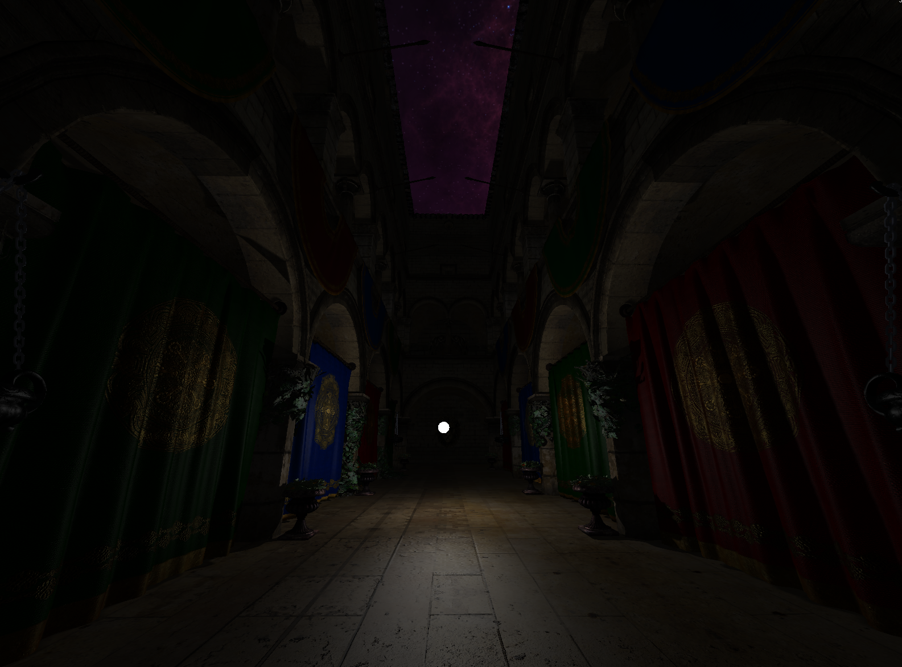

# 🔥 DirectX_on_top — DirectX 11 Engine

 
   
   
   
  <b>Custom DirectX11 engine built for scalable workflows, and visual effects experimentation.</b> 

## 🎯 Vision

This engine is designed for:

- Graphics experiments
- Learning and extending rendering techniques
- Fast Implementing Visual Effects

## 🚀 Propeties:

- **Cube Shadow Mapping** — Gathering depth data from light POV, using it for shadow mapping.
- **Frustum Culling** — Almost complete, leveraging compute shaders for efficiency.
- **Sheet Sample** — Using Hull + domain shaders to produce wave effect on tessellated surface.
- **RenderGraph System** — Scalable, modular render pipeline system.
- **Effects System** — Modular, scalable workflow with Bindables for flexibility.
- **Multi-Camera Support** — Preview multiple cameras in real-time, fully integrated into the gui.
- **Skybox** — Makes scene immersive.

## 📸 Gallery:

Shadow Mapping

 
   
   

Specular & Visual Fidelity

   
   

Editor & Camera Previews

 
  

## 🛠 Dependencies

### [ImGui](https://github.com/ocornut/imgui) & [Freetype](https://github.com/freetype/freetype)
- Imgui built in separate project -> single `.lib`  
  - Faster builds  
  - No imgui warnings  
- Freetype required by my ImGui config

### [DirectXTK](https://github.com/microsoft/DirectXTK) & [DirectXTex](https://github.com/microsoft/DirectXTex)
- Must use `*_Desktop_2022_Win10.sln`
- Build **x64 Debug/Release** -> produces `.lib` files

### [Assimp](https://github.com/assimp/assimp)
- Get pre-built binaries from Assimp itch.io
